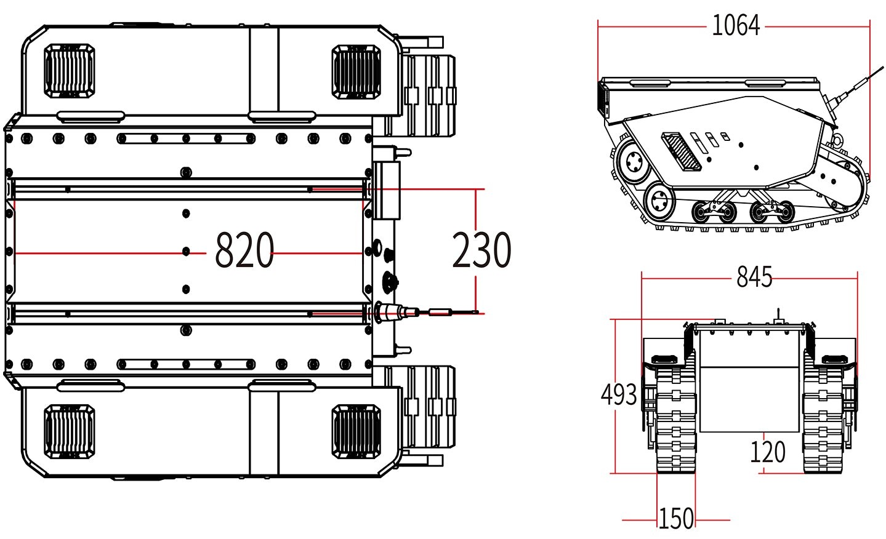

==============
Specifications
==============

.. contents::
    :local:

Bill of Materials
=================

*   1x BUNKER PRO Robot Body
*   1x Battery Charger (220VAC)
*   1x Aviation Plug Male 4-Pin
*   1x USB-to-CAN Module
*   1x RC Transmitter

Specifications Overview
=======================

.. list-table::
    :align: center

    * - Dimensions
      - 1064mm x 845mm x 473mm
    * - Weight
      - 150kg
    * - Payload
      - 120kg
    * - Operating Temperature
      - -20°C to 60°C
    * - IP Rating
      - IP67
    * - Battery
      - 48V60Ah
    * - Charging Time
      - 4.5 hours
    * - Operating Time (No Load)
      - 3 hours
    * - Communication
      - CAN Interface
    * - Maximum Speed (No Load)
      - 1.5m/s
    * - Maximum Climbable Obstacle Height (No Load)
      - 180mm
    * - Maximum Climbable Slope (No Load)
      - 30°
    * - Minimum Ground Clearance
      - 120mm
    * - Motors
      - Two 1500W Brushless Motors

Major Dimensions
================

